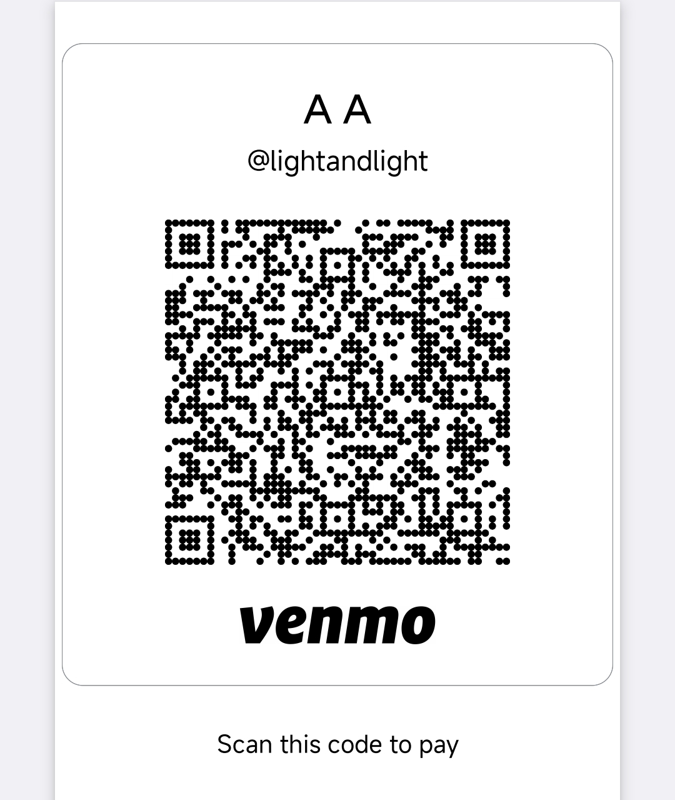

- This is a full stack social media mobile app developed using Flutter and Dart, simulation to an exsiting app.
- The app utilizes Firebase for authentication, storage, and real-time database management to enhance responsiveness and ensure interactive and engaging user interfaces.
- If this is helpful to you, plase kindly support me here: 

##Installation
To run the app locally, follow these steps:

- Clone the repository to your local machine.
- Make sure you have Flutter and Dart installed.
- Set up Firebase for authentication, storage, and real-time database.
- Update the Firebase configuration in the app to connect to your Firebase project.
- Run flutter pub get to install dependencies.
- Launch the app on your preferred platform using flutter run.
